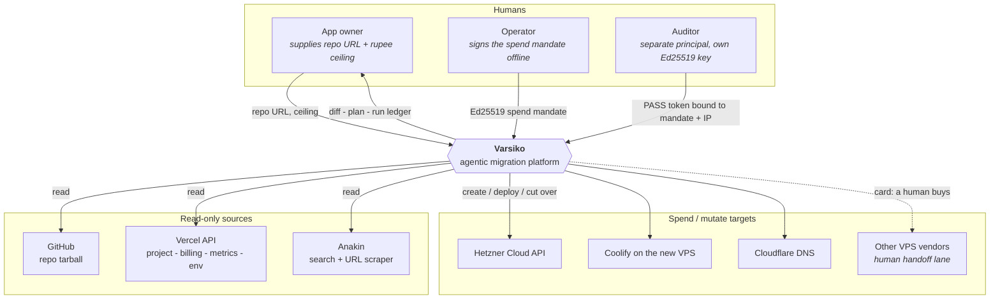
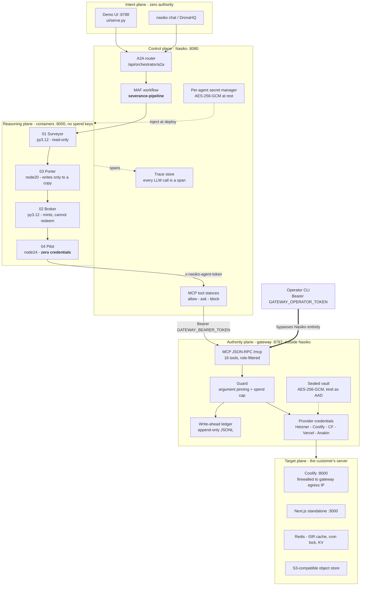
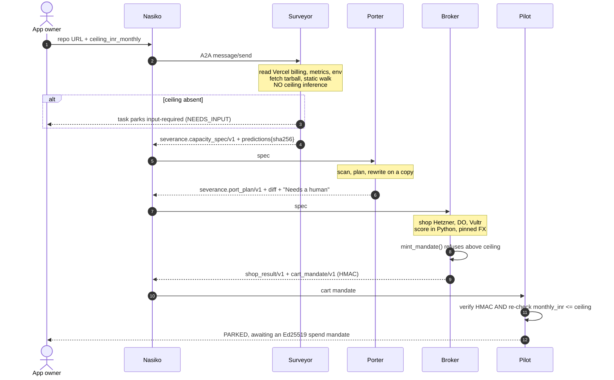
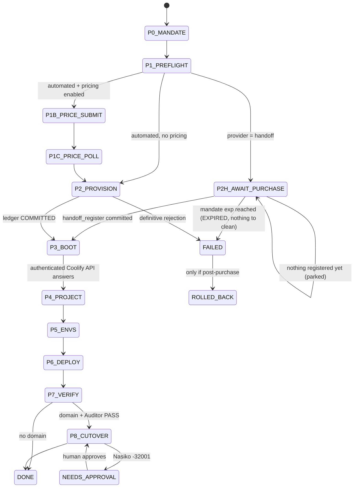
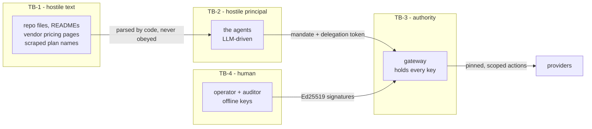
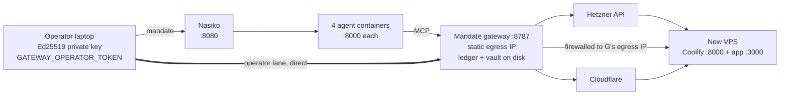
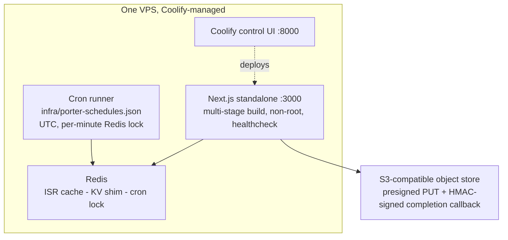

# Varsiko — Solution Architecture

**System:** Varsiko / Severance — an agentic DevOps platform that moves a Vercel-coupled Next.js
application onto owned infrastructure, under a signed human mandate, without a human running a
single command.

| | |
|---|---|
| **Version** | 1.0 |
| **Date** | 2026-09-20 |
| **Status** | Living document. Supersedes the architecture fragments in `agent-1-plan.md` §1–3 and `agent-4-plan.md` §2–6. |
| **Scope** | The whole solution: four agents, the control plane, the authority plane, the operator plane, the delivered customer runtime, and the platform's own build/release pipeline. |

### How to read this document

Every claim carries a provenance tag. This repo's culture is that an unverified claim is a defect,
and that culture is encoded here rather than dropped.

| Tag | Meaning |
|---|---|
| **[BUILT]** | Implemented and covered by tests in this repo. File references are real. |
| **[TARGET]** | Designed here, not yet implemented. The design is normative — build to it. |
| **[UNVERIFIED]** | Depends on external behaviour never observed on live infrastructure. Carries a risk-register ID (§17). |

---

## 0. The one-paragraph architecture

A human gives Varsiko a GitHub URL and a rupee ceiling. Four A2A agents run as containers on the
**Nasiko** control plane: the **Surveyor** reads the live Vercel project and the repo and emits a
falsifiable capacity spec; the **Porter** dry-runs a rewrite that removes Vercel coupling from the
source; the **Broker** shops VPS vendors adversarially and mints an HMAC-signed *cart* mandate it
cannot itself redeem; the **Pilot** redeems an Ed25519-signed *spend* mandate that a human signed
offline, and drives a resumable eight-step runbook that buys a server, boots Coolify, migrates
environment variables, deploys, verifies and — only behind a second human gate — cuts DNS over.
No agent holds a provider credential. All spend authority lives in a separate process, the **mandate
gateway**, which re-verifies the signed mandate on every single tool call and pins every provisioning
argument to what the human approved. The organising principle is that **authority is a signed,
scoped, single-use capability that travels with the request** — never a role attached to an identity,
because the thing holding the identity is a language model reading attacker-controlled text.

---

## 1. Problem and product thesis

### 1.1 The problem

Vercel is easy to enter and expensive to leave. The expense is not the bill — it is that the exit is
gated on tacit knowledge. An app that runs on Vercel has absorbed Vercel-shaped assumptions
(`@vercel/blob`, `@vercel/kv`, `vercel.json` crons, ISR backed by a per-instance `.next/cache`,
`runtime = 'edge'`, `@vercel/functions` geolocation). A naive `next start` in Docker **appears to
work** and is silently wrong.

That asymmetry is the whole design driver:

> The failure mode that ruins a migration is not the build that breaks. It is the thing that keeps
> working and quietly stops being correct.
> — [porter/README.md](agents/severance/porter/README.md)

### 1.2 The thesis

Three claims the architecture must make true:

1. **The cost delta is falsifiable.** The Surveyor commits a hashed prediction block — expected load
   profile, expected utilisation on the floor spec, named falsifiers — *before* anything is
   provisioned. A separate Auditor load-tests against it. A component that both predicts and
   validates proves nothing.
2. **The rewrite is honest.** The Porter reports what it could not fix rather than marking it done.
   Re-running is a no-op; `--dry-run` does the real work on a throwaway copy, so the diff it shows is
   the diff you would get.
3. **The spend is bounded by a human signature, not by a prompt.** A ceiling in a system prompt is a
   promise. A refusal inside a signature-verifying guard that returns an error object and has a test
   is a control.

---

## 2. Architectural invariants

These are the axioms. Every structural decision below is derivable from one of them. A change that
breaks one is an architecture change, not an implementation change.

| # | Invariant | Why it exists | Enforced at |
|---|---|---|---|
| **I1** | **The LLM narrates. Code decides.** A model may parse a message and write a summary. It may never size a server, classify a lock-in, pick a verdict, or authorise a spend. | Every number in the output must trace to an API response or a deterministic rule, or nothing downstream can be falsified. | Pure modules, no network, no LLM: `surveyor/{intake,lockin_scan,capacity,cost,predict,verdict,emit}.py`, `broker/{scoring,mandate,verify,fx,card}.py`, `pilot/{guard,mandate,ledger,pricing}.ts` |
| **I2** | **Authority is a signed capability, not a role.** The right to spend travels as a single-use, scoped, expiring, human-signed token — verified on *every* call, never cached as session state. | The identity holding the credential is an LLM reading attacker-controlled text. Role-based auth grants that identity everything the role can do, forever. | `pilot/mandate.ts`, re-verified per call in `gateway/tools.ts::requireMandate` |
| **I3** | **The predictor never validates.** | Self-validation is not evidence. | Surveyor emits `predictions` + hash; the Auditor — a separate principal with its own Ed25519 key — issues the PASS token that gates cutover |
| **I4** | **One step per call; every step resumable and idempotent.** | Nasiko's flow guard kills an agent-to-agent call at 120 s and MAF retries a failed step 3×. A 95-second purchase whose response is lost at 120 s returns as "failure" and is retried — into three servers. | `pilot/runbook.ts::advance()` executes exactly one step and returns; callers poll |
| **I5** | **Untrusted text never becomes authority.** Repo files, READMEs, vendor pricing pages and scraped plan names are attacker-reachable. They may inform a *display*; they may never widen a bound. | Prompt injection and price poisoning are the two live attack surfaces of an agent that spends money. | `pricing.ts` (`effective = max(pinned, scraped)`), charset/length clamps in `mandate.ts`, injection tests in both Python agents |
| **I6** | **Secrets flow down, never up.** A credential moves toward the thing that must use it and never back toward the thing that asked. | The agent is the least trustworthy principal in the system, so it must be the one with nothing to steal. | Gateway vault (AES-256-GCM, `kind` bound as AAD); `vercel_env_export` returns a *sealed ref*, never values |
| **I7** | **Unfixable is reported, never dropped.** | A migration that silently omits a finding is worse than one that refuses. | Porter "Needs a human" section; Pilot logs the names of Vercel `sensitive` vars it could not export |
| **I8** | **Offline by default.** Every agent ships with `*_OFFLINE=1` and a fixture store. | The demo path must be *incapable* of spending money, and CI must be network-free and deterministic. | `SURVEYOR_OFFLINE` / `BROKER_OFFLINE` / `PORTER_OFFLINE` / `PILOT_OFFLINE`, set in every `Dockerfile` and in `deploy-nasiko.sh` |

---

## 3. System context (C4 level 1)



**Three human principals, deliberately.** The owner asks. The operator authorises spending with a key
Varsiko never holds. The auditor certifies the result with a *different* key. Collapsing any two of
them collapses a control: owner + operator removes the spend gate; operator + auditor lets the party
that paid for the server also certify that it works (I3).

---

## 4. Plane decomposition

The system separates into five planes by **what each is trusted to do**, not by what it is made of.
This is the load-bearing decomposition; everything else follows it.

| Plane | Holds | Trusted to | Explicitly cannot |
|---|---|---|---|
| **Intent** — demo UI, `nasiko chat`, DronaHQ [TARGET] | nothing | collect a repo URL and a ceiling | set a ceiling on the user's behalf — the Surveyor *refuses* an inferred ceiling |
| **Control** — Nasiko | agent images, per-agent secrets, MCP connector stances, traces, the MAF workflow | route A2A, mint short-lived delegation tokens per inbound request, apply `allow`/`ask`/`block`, record every span | enforce a rupee cap — TokenOps counts LLM tokens only |
| **Reasoning** — the four agents | a mandate *as a bearer capability*; read-only API tokens (Surveyor, Broker) | read, analyse, propose, narrate | hold a provider credential (Pilot holds **zero**), choose a target IP, widen a bound |
| **Authority** — mandate gateway + write-ahead ledger + sealed vault | **all** spend credentials, the vault key, the mandate public key | verify a signature, pin arguments, claim a nonce, execute *one* pinned action | be reached without a mandate; accept a caller-chosen IP, host or URL |
| **Target** — the customer's new VPS | the customer's app, its env, its data | run the app | reach back into any other plane |



**The one edge that matters:** the Pilot's arrow into the gateway carries a *delegation token* that
proves which agent is calling, and a *mandate* that proves what a human authorised. The gateway
requires both. Compromising the agent yields the first and not the second.

---

## 5. Container view (C4 level 2)

| Component | Runtime | Image base | Listens | Authority held | Source |
|---|---|---|---|---|---|
| Surveyor | Python 3.12, `a2a-sdk==0.3.26`, uvicorn | `python:3.12-slim` | `:8000` A2A | `VERCEL_TOKEN` (read), `GITHUB_TOKEN` (read) | [surveyor/](agents/severance/surveyor) |
| Broker | Python 3.12, same stack | `python:3.12-slim` | `:8000` A2A | `ANAKIN_API_KEY`, `MANDATE_SIGNING_SECRET` | [broker/](agents/severance/broker) |
| Porter | Node 20, TS compiled to `dist/`, multi-stage | `node:20-bookworm-slim` | `:8000` A2A | none | [porter/](agents/severance/porter) |
| Pilot agent | Node 24, native TS type-stripping | `node:24-bookworm-slim` | `:8000` A2A | **none** — mandate only | [pilot/src/agent/](agents/severance/pilot/src/agent) |
| **Mandate gateway** | Node 24, stdlib HTTP + MCP JSON-RPC | not containerised — [TARGET §14.6] | `:8787` `/mcp` | **everything** | [pilot/src/gateway/](agents/severance/pilot/src/gateway) |
| Operator CLI | Node 24 | runs on the operator's machine | — | Ed25519 mandate **private** key, `GATEWAY_OPERATOR_TOKEN` | [pilot/src/cli/](agents/severance/pilot/src/cli) |
| Demo UI | Python stdlib only, zero dependencies | — | `:8788` | Nasiko login only | [ui/serve.py](ui/serve.py) |
| Nasiko | external control plane | — | `:8080` | agent secrets, images, stances | out of repo |

**Deliberate asymmetries.** The Pilot *agent* and the *gateway* are one package and two processes,
because the boundary between "the thing an LLM drives" and "the thing that holds the Hetzner token"
must be a process boundary with its own authentication — not a module boundary that an `import` can
cross. The operator CLI is a third consumer of the same package, holding the one key neither of the
other two may ever see.

---

## 6. End-to-end flow

### 6.1 The MAF pipeline

One workflow, `severance-pipeline`, upserted by
[deploy-nasiko.sh](agents/severance/deploy-nasiko.sh): **Surveyor → Porter → Broker → Pilot.**
Porter dry-runs. Pilot parks on a cart mandate and completes no purchase inside the MAF hop.

### 6.2 Assessment through parked cart



**Why the Pilot re-checks a ceiling the Broker already enforced:** if the Broker is fully compromised,
the independent check in the Pilot still refuses an over-cap cart mandate. Two mechanisms, neither
sufficient alone — a pattern that repeats at the DNS gate (§8.5).

### 6.3 The spend run, outside the MAF hop

```mermaid
sequenceDiagram
    autonumber
    actor OP as Operator
    participant PI as Pilot agent
    participant N as Nasiko stances
    participant G as Mandate gateway
    participant H as Hetzner
    participant C as Coolify
    actor AU as Auditor

    OP->>OP: npm run mandate (Ed25519, offline key)
    OP->>PI: run.start(mandate)
    PI->>PI: claim nonce write-ahead
    PI-->>OP: run_id, returned immediately

    loop one step per poll - flow guard is 120 s
        OP->>PI: run.poll(run_id)
        PI->>N: tools/call
        N->>G: Bearer + mandate
        G->>G: verify sig, exp, scope; pin args; cap spend
        G->>G: ledger INTENT BEFORE the spend
        G->>H: POST /servers (labelled mandate_id)
        H-->>G: id + ip
        G->>G: ledger COMMITTED
        G->>C: health, project, envs, deploy
        PI-->>OP: step, state, committed cost, next_owner
    end

    AU->>AU: load-test against surveyor predictions
    AU-->>OP: Ed25519 PASS token bound to mandate + IP
    OP->>PI: run.cutover(token)
    PI->>N: cloudflare_dns_upsert
    N-->>PI: -32001 NEEDS_APPROVAL
    OP->>N: approve
    PI->>G: retry; gateway verifies the PASS token independently
    G->>G: DNS upsert, TTL 60, IP read from the ledger
```

---

## 7. Data contracts

### 7.1 The schema chain

```
severance.capacity_spec/v1   Surveyor -> Porter, Broker
severance.port_plan/v1       Porter   -> operator, UI
severance.shop_result/v1     Broker   -> UI
severance.cart_mandate/v1    Broker   -> Pilot      [HMAC-SHA256, shared secret]
<spend mandate>              Operator -> Gateway    [Ed25519, offline key]
severance.pilot_run/v1       Pilot    -> operator, UI
```

### 7.2 Contract rules

Enforced today; normative for any future change.

1. **The schema string is the discriminator.** `looks_like_spec` greps for the literal
   `severance.capacity_spec/v1`. Renaming is a breaking change: bump to `/v2` and run both.
2. **Integers are integers.** `capacity.vcpu`, `ram_gb`, `disk_gb`, `constraints.spec_floor.*` and
   `current_cost.monthly_inr` are `int` in the Broker's Pydantic model; producers `ceil()` before
   emitting. `egress_tb` is a float. A float where an int is modelled is a hard validation failure,
   not a coercion.
3. **`extra="allow"` is the extension mechanism.** The Surveyor's extra blocks (`predictions`,
   `lockin_detail`, `method.constants`) ride along on the same object the Broker parses. Additive
   fields are non-breaking by construction.
4. **Nested models drop unknown keys.** `LockinFeature` keeps only `feature` and `breaks_on_selfhost`,
   so **the Porter must read `lockin_detail` from the Surveyor file, not from the mandate** — the
   mandate carries only the thin list. This is load-bearing, not a footnote.
5. **A missing bound is a refusal, never a default.** No `constraints.ceiling_inr_monthly` → Surveyor
   `NEEDS_INPUT`, Broker hard-stops `MISSING_CEILING`. Nothing anywhere substitutes a value.
6. **FX is pinned, never fetched.** `FX_USD_INR`, `FX_EUR_INR`, `FX_PINNED_AT` are injected and
   identical across Surveyor and Broker. A live rate makes two runs of the same repo disagree, and
   makes a signed mandate unverifiable after the fact.
7. **Cross-agent vocabulary is shared, not parallel.** Region names must match between Surveyor and
   Broker. [RISK-04]

### 7.3 Contract testing

[surveyor/tests/test_contract_vs_broker.py](agents/severance/surveyor/tests/test_contract_vs_broker.py)
validates the Surveyor's emitted spec against the Broker's own Pydantic model — a consumer-driven
contract test, in-repo, no network. **[BUILT]**

**[TARGET]** Extend the same pattern to the three remaining edges (Surveyor→Porter, Broker→Pilot,
Pilot→UI) and run all four as a dedicated CI job (§14.3, gate **G3**), so a producer change that
breaks a consumer fails before merge rather than during a demo.

---

## 8. Authority architecture

This is the heart of the system. If you read one section, read §8.6.

### 8.1 Two mandates, two cryptosystems, on purpose

| | Cart mandate | Spend mandate |
|---|---|---|
| Issued by | Broker (an agent) | Operator (a human, offline) |
| Primitive | **HMAC-SHA256**, `MANDATE_SIGNING_SECRET` | **Ed25519** over canonical JSON |
| Key distribution | symmetric, agent-scoped on Broker **and** Pilot | private key never leaves the operator's machine; the gateway holds only the public key |
| Means | "these plans fit the ceiling" | "spend this money, on exactly this, once" |
| Redeemable by its issuer? | **No** — the Broker cannot buy | n/a |
| TTL | `MANDATE_TTL_SECONDS`, default 900 s | `exp`; handoff lane defaults to 24 h, max 72 h |

Symmetric is correct for the cart mandate: both ends are machines Nasiko provisions, and the verifier
is allowed to be able to mint. Asymmetric is *required* for the spend mandate: the verifier (the
gateway) must be **unable** to mint, or a gateway compromise becomes a money-printing compromise.

### 8.2 The mandate as a capability

```jsonc
{
  "mandate_id": "mdt_8891", "nonce": "...", "iat": "...", "exp": "...",
  "approved_by": "operator@...",
  "scope": ["hetzner:server.create", "hetzner:server.delete", "coolify:*",
            "cloudflare:dns.upsert", "cloudflare:dns.rollback",
            "vercel:env.export", "anakin:scrape.*"],
  "budget":    { "max_monthly_usd": 60, "max_hourly_usd": 0.12 },
  "provision": { "provider": "hetzner", "server_type": "cpx31", "image": "ubuntu-24.04",
                 "location": "nbg1", "count": 1, "cloud_init_sha256": "<sha256 of template>" },
  "migration": { "vercel_project_id": "...", "git_repository": "...",
                 "git_branch": "...", "domain": "..." },
  "surveyor_prediction_sha256": "...",
  "run_window_minutes": 120
}
```

Five properties make this a capability rather than a claim:

- **Scoped** — `scope` is checked by a namespace-aware matcher (`ns:verb`, `ns:*`, `ns:pre*`) in
  `guard.ts::scopeCovers`. A tool outside scope is refused regardless of who calls it.
- **Pinned** — server type, image, location, count, cloud-init **hash**, project name, repo, branch
  and Vercel project must *equal* the mandate's values. The Pilot proposes; the guard compares.
- **Capped** — the spend cap is enforced in code, because Nasiko's TokenOps tracks LLM tokens and
  **cannot** enforce a cloud bill.
- **Single-use** — the nonce is claimed write-ahead in the ledger (§9.2).
- **Time-bounded in two stages** — `exp` bounds the authority to *start* spending; after the purchase,
  `run_window_minutes` runs from the committed purchase. Rollback deliberately outlives both.

### 8.3 Three verification phases

`requireMandate(deps, args, phase)` picks strictness by phase, and each choice is reasoned:

| Phase | Checks | Rationale |
|---|---|---|
| `spend` | signature **and** `exp` | only the initial purchase and the pre-purchase price scrape need *fresh* authority |
| `continue` | signature, plus the run window measured from the committed purchase | deploy steps must not be blocked by a clock that expired mid-install |
| `rollback` | signature only | cleanup must stay possible after everything else expires — and it is confined to resources this mandate itself created |

### 8.4 Role split: two bearers on one gateway

The gateway authenticates two distinct credentials and filters **both `tools/list` and `tools/call`**
by role (`gateway/mcp.ts`). Each tool belongs to exactly one role; a cross-role call returns
`FORBIDDEN_ROLE`, and the agent cannot even enumerate the operator's tools.

| Credential | Held by | Reaches | Cannot |
|---|---|---|---|
| `GATEWAY_BEARER_TOKEN` | Nasiko's MCP connector, therefore the Pilot agent | 14 tools | `handoff_prepare`, `handoff_register` |
| `GATEWAY_OPERATOR_TOKEN` | the human operator's CLI, **outside Nasiko** | `handoff_prepare`, `handoff_register` | buy anything |

**Why the split exists.** In the handoff lane a human buys the server at an arbitrary vendor, so the
new machine's IP is *the one input that comes from a person*. The gateway then sends that address its
Coolify token and every migrated environment variable. An unvalidated address supplied by an
LLM-driven agent would be a direct SSRF-and-exfiltration primitive. Hence a separate credential, plus
`gateway/ip.ts` accepting only a **public IPv4 unicast** address — refusing loopback, RFC 1918,
link-local (including `169.254.169.254`), CGNAT, multicast, reserved ranges, IPv6, hostnames and
ports. The Pilot *reads* the registered address through `handoff_status`; it can never supply one.

### 8.5 Defence in depth — no single mechanism is sufficient

| Threat | Mechanism A | Mechanism B (independent) |
|---|---|---|
| Over-cap purchase | Broker refuses inside `mint_mandate()` | Pilot re-checks `monthly_inr <= ceiling` on a mandate it did not mint |
| Unauthorised DNS cutover | Nasiko `ask` stance returns `-32001`; a human approves | gateway verifies an Ed25519 Auditor PASS token bound to **this** mandate **and this** server IP |
| Double purchase on a lost response | write-ahead `INTENT` row refuses a re-spend | gateway **reconciles by Hetzner label** instead of re-buying |
| Poisoned vendor price | `effective = max(pinned, scraped)` — a page can only *raise* the budgeted price | pinned fallback price table in `guard.ts` |
| Agent reaching a provider directly | `tool-rules.json` disables every other connector | the gateway is the only holder of provider credentials |
| Compromised agent spending | no credentials on the agent | every gateway call re-verifies the human signature |

### 8.6 The principle, stated once

> **The agent is treated as hostile.** Not as untrusted input — as a hostile *principal* that will be
> asked, by text inside a repository or a vendor's pricing page, to do something its operator never
> authorised. Every capability it holds is therefore scoped to one action, pinned to arguments a human
> signed, single-use, expiring, and independently re-verified by a process the agent cannot modify.

Everything in §8 is a consequence of that sentence.

### 8.7 Where the handoff lane is weaker than the automated lane

Stated plainly, because an architecture that hides its weak edge is a liability.

- **The spend cap is not enforceable.** The human pays at the vendor's checkout.
  `expected_monthly_usd` is pinned in the mandate and printed on the card marked **UNVERIFIED**;
  nothing can observe what was actually charged.
- **Argument pinning stops at the card.** Vendor, plan, region, image and cloud-init hash are pinned
  and rendered deterministically, but the vendor's checkout is unobservable. A human who buys the
  wrong plan gets a working migration onto the wrong server.
- **Compensating controls:** no-destroy (rollback never deletes a server the Pilot did not buy);
  cross-provider refusal (`hetzner:*` tools refuse a handoff mandate and vice versa — `WRONG_PROVIDER`,
  checked in the guard **and** in each tool); charset clamps so scraped vendor, plan and region text
  cannot carry a newline or a backtick onto the rendered card.

---

## 9. Execution architecture

### 9.1 The runbook state machine

`advance()` executes **exactly one** step and returns. Every step re-verifies the mandate rather than
trusting state carried between calls.



**Why one step per call.** Nasiko's flow guard kills any agent-to-agent call at **120 s**; MAF retries
a failed step **3×**; a Coolify install takes minutes. A synchronous runbook would be killed
mid-purchase and retried into a double purchase. Nasiko also mints the delegation token *per inbound
request* with a lifetime of minutes, so a long-lived background loop could not authenticate anyway.
The parked states (`P2H_AWAIT_PURCHASE`, `NEEDS_APPROVAL`) are **not failures** — `run()` treats them
as terminal so a polling loop parks instead of spinning, and `live --resume` reopens them.

### 9.2 The write-ahead ledger — the system of record

Append-only JSONL, one row per state transition, keyed `mandate_id:step`.

```
INTENT  ──► (side effect at the provider) ──► COMMITTED
   │
   └── response lost / ambiguous ──► row stays INTENT ──► reconcile by Hetzner label, never re-buy
```

| Property | Mechanism |
|---|---|
| No double spend | `INTENT` is written **before** the provider call; a retry finds it and refuses |
| Lost-response safety | an ambiguous outcome leaves `INTENT` open; the gateway reconciles by the `mandate_id` label it stamped on the server |
| Replay protection | the nonce is claimed at `run.start`; a second run on the same mandate is `REPLAY` |
| Target derivation | Coolify and DNS tools take **no** IP, host or URL — the gateway derives the server from its own ledger rows |
| Rollback confinement | `hetzner_server_delete` refuses any server not labelled with the calling mandate's id |
| Single clock | the ledger's `now` is injectable, so ledger timestamps and mandate expiry share one clock |

The handoff lane writes the **same `P2` row** (`server_id: "handoff:<ip>"`) that an automated purchase
writes, so target derivation, the run window, replay protection and every downstream tool work
unchanged. That is the reason the two lanes are one runbook instead of two.

**[TARGET]** `FileLedger` is an append-only JSONL file with a whole-file read on `rows()`. The
`Ledger` interface is already the seam: swap in Postgres (`UNIQUE(key)` giving the claim atomically,
`SELECT ... FOR UPDATE` for reconciliation) when more than one gateway instance exists (§16.2).

### 9.3 Failure taxonomy

The distinction that makes automated rollback safe:

| Class | Trigger | Caller must | Runbook does |
|---|---|---|---|
| `PROVIDER_REJECTED` | definitive 4xx | stop | fail; roll back if post-purchase |
| `PROVIDER_AMBIGUOUS` | 5xx, 429, timeout | retry | retry (≤3) against idempotent tools; never destroy |
| `ToolError` (`BAD_ARGS`, `WRONG_PROVIDER`, `REPLAY`, `NO_SERVER`, `RUN_WINDOW_EXPIRED`) | guard or gateway refusal | fix the mandate | fail, no side effect |
| `-32001 NEEDS_APPROVAL` | Nasiko `ask` stance | approve | park, do not fail |
| `-32000 BLOCKED` | Nasiko `block` stance | nothing | fail |

Without this split, a network blip during deploy would be indistinguishable from a refusal, and the
compensation would delete a healthy, paid-for server.

### 9.4 Compensation matrix

| Failure point | Compensation | Never |
|---|---|---|
| before `P2` commit | none needed — nothing was bought | — |
| `P2` ambiguous | reconcile by label; adopt the existing server | buy a second |
| `P3`–`P7`, automated | `hetzner_server_delete`, mandate-labelled only | delete an unlabelled server |
| `P3`–`P7`, handoff | **no destroy** | delete a server a human paid for |
| `P8` cutover fails | `cloudflare_dns_rollback` restores the previous record, or deletes the one it created | destroy the server — a failed cutover is not a failed migration |
| approval pending | park | roll back |

### 9.5 Timing budget

| Bound | Value | Source |
|---|---|---|
| A2A call wall clock | 120 s hard kill | Nasiko flow guard |
| MAF step retries | 3 | `MAF_MAX_ATTEMPTS` default |
| Full migration | 3–6 min, hence polled | measured offline |
| Coolify boot poll | 20 polls automated / **60** handoff | a vendor whose boot time we have never measured deserves more patience |
| Run window after purchase | 120 min default | mandate `run_window_minutes` |
| Cart mandate TTL | 900 s | `MANDATE_TTL_SECONDS` |
| Spend mandate `exp` | operator-set; handoff 24 h default, 72 h max | `mandate.ts` |
| Sealed env blob TTL | 30 min | `ENV_BLOB_TTL_MS` |
| Vault secret TTL | 7 days | `SECRETS_TTL_MS` |
| DNS record TTL | 60 s | set at upsert, so rollback propagates fast |

---

## 10. Trust boundaries and threat model

### 10.1 Boundaries



### 10.2 Threat register

| # | Threat | Vector | Control | State |
|---|---|---|---|---|
| T1 | Prompt injection via repo | `README.md`, page text in a scanned repo | code decides, LLM only narrates (I1); dedicated injection tests in Surveyor and Broker; repo is never executed | [BUILT] |
| T2 | Price poisoning | a vendor edits its pricing page | `max(pinned, scraped)`; a page can only raise the budgeted price | [BUILT] |
| T3 | SSRF via scrape | agent supplies an arbitrary URL | Anakin may fetch exactly **one** pinned URL; markdown capped at 200 KB | [BUILT] |
| T4 | SSRF / exfiltration via registered IP | operator or agent registers a metadata address | public-IPv4-unicast-only validation in `ip.ts`; operator credential required | [BUILT] |
| T5 | Double / runaway spend | flow-guard kill + MAF retry | write-ahead ledger, nonce claim, label reconciliation, `count == 1` | [BUILT] |
| T6 | Argument substitution | agent proposes a bigger server than approved | guard pins every provisioning parameter to the mandate | [BUILT] |
| T7 | cloud-init injection | template tampering | mandate pins the template **SHA-256**; only 5 whitelisted `__TOKEN__` placeholders, strict charset, no shell syntax | [BUILT] |
| T8 | Coolify token theft in transit | Coolify API is plain HTTP on `:8000` until TLS | provisioning **refused** without a Hetzner firewall unless `ALLOW_INSECURE_COOLIFY_HTTP=true`; only the token's **hash** goes into `user_data` | [BUILT] / [RISK-01] |
| T9 | Secret leakage into traces | Nasiko traces every LLM call as a span | secrets live in the per-agent vault, never in messages; an agent refuses a token pasted into chat; clients redact under `inspect` and `JSON.stringify` | [BUILT] |
| T10 | Second path around the mandate | another MCP connector shares the same provider API | `tool-rules.json` sets every other connector `enabled: false` with a `*` block | [BUILT] / [RISK-02] |
| T11 | Privilege creep via default-allow | Nasiko per-agent permission is **default-allow** | explicit rule list **plus a trailing `{"pattern":"*","stance":"block"}`**, applied before first deploy | [BUILT] / [RISK-02] |
| T12 | Gateway compromise mints authority | — | gateway holds only the mandate **public** key; it can verify, never sign | [BUILT] |
| T13 | Stale DNS after a bad cutover | — | TTL 60 + `cloudflare_dns_rollback` restoring the captured previous record | [BUILT] |

### 10.3 Assumed-breach posture

| If this is fully compromised | The attacker gets | The attacker still cannot |
|---|---|---|
| Any agent container | read-only Vercel/GitHub tokens, a mandate it was already given | spend outside the pinned arguments, cut DNS over, reach a provider directly |
| Broker | ability to mint cart mandates | exceed the ceiling — the Pilot re-checks independently — or buy anything |
| Nasiko control plane | agent secrets, delegation tokens, the gateway bearer | forge the operator's Ed25519 signature, so no spend mandate |
| Gateway host | every provider credential — **total loss for spend** | mint a new mandate, or delete servers outside the mandate's label |
| Operator machine | the signing key — **total loss** | — (this is why the key is offline and mandates are single-use, capped and expiring) |

---

## 11. Secrets and key management

| Secret | Lives in | Reaches | Never reaches |
|---|---|---|---|
| `VERCEL_TOKEN` (read) | Nasiko per-agent vault → Surveyor | Surveyor, gateway (`vercel_env_export`) | Pilot agent, chat, traces |
| `GITHUB_TOKEN` (read) | Nasiko per-agent vault → Surveyor | Surveyor | anything else |
| `ANAKIN_API_KEY` | Nasiko vault → Broker; gateway for Pilot's lane | Broker, gateway | Pilot agent |
| `MANDATE_SIGNING_SECRET` | Nasiko vault, **agent-scoped** on Broker **and** Pilot | both | vault-wide scope — that would let any agent mint a cart mandate |
| Mandate **private** key (Ed25519) | operator's machine, `.local/keys/` (gitignored) | nothing | Nasiko, gateway, any container — by design |
| Mandate **public** key | gateway `MANDATE_PUBLIC_KEY_FILE` | gateway | — |
| Auditor private key | auditor's machine | nothing | everything else |
| `HETZNER_TOKEN`, `CLOUDFLARE_TOKEN` | gateway process env | gateway only | every agent |
| Coolify API token | gateway sealed vault (AES-256-GCM, `kind` as AAD) | gateway → new server | Pilot agent; only the **SHA-256** goes into `user_data` |
| Migrated app env values | gateway sealed vault, 30-min sealed ref | gateway → Coolify | Pilot agent, which receives a ref, a count and the **names** it could not read |
| `GATEWAY_BEARER_TOKEN` | Nasiko MCP connector | Nasiko → gateway | operator tools |
| `GATEWAY_OPERATOR_TOKEN` | operator's shell | gateway | Nasiko, every agent |

**Rules.** ≥32 chars for both bearers, and they must differ — enforced at config load, not by
convention. Coolify's root password appears only in rendered cloud-init, which lands in `.local/`
(gitignored) and is shown to the operator alone. `data/` and `*.pem` are gitignored. Vercel
`sensitive` variables are write-only and **cannot** be exported; the Pilot logs their names
(`WARN ... NOT moved, re-enter by hand: STRIPE_SECRET_KEY`) rather than silently dropping them (I7).

**[TARGET] Rotation.** Bearers and the vault key rotate per environment on a 90-day clock; the
mandate keypair rotates per operator, with the retired public key kept until the last mandate signed
under it expires. Rotation is a gateway restart plus a Nasiko connector update — no agent redeploy,
because no agent holds either.

---

## 12. Observability and audit

Three independent records, deliberately not merged:

| Record | Written by | Answers | Retention [TARGET] |
|---|---|---|---|
| **Traces** (OTLP spans; the Python agents ship the full OTel instrumentation set — httpx, starlette, openai, anthropic) | agents → Nasiko | "what did the model see and say?" | 30 days |
| **Audit log** (one line per `tools/call`: tool, role, `run_id`, mandate id, outcome, code, ms — **never** a token, never cloud-init content) | gateway | "what was attempted against real infrastructure, by which credential?" | 1 year |
| **Ledger** (append-only JSONL) | gateway | "what was actually spent, and is it safe to retry?" | forever — it is the system of record |

The separation is the point: the trace can be voluminous and lossy, the audit log is security
evidence, and the ledger must survive a crash mid-purchase because correctness depends on it.

**[TARGET] Golden signals and alerts**

| Signal | Alert condition |
|---|---|
| `INTENT` rows with no terminal state | any row open > 15 min — a possible orphaned paid server |
| `FORBIDDEN_ROLE` / `stance: block` refusals | any occurrence — this means someone is calling something they should not |
| `PROVIDER_AMBIGUOUS` rate | > 10% of calls in 15 min — provider degradation |
| Runs parked in `NEEDS_APPROVAL` | > 30 min — a human is blocking the pipeline |
| `EXPIRED` handoff runs | any — the card reached nobody |
| Gateway p95 tool latency | > 5 s |
| Committed spend vs `budget.max_monthly_usd` | > 80% |

**[TARGET]** Ship gateway audit lines to the same OTLP collector as the agent spans, correlated by
`run_id`, so one query reconstructs an entire migration across all three records.

---

## 13. Deployment architecture

### 13.1 Environments

| Env | Control plane | Agents | Gateway | Spend | Purpose |
|---|---|---|---|---|---|
| **Local dev** | none | `npm start` / `python -m ...` on `:8000` | `npm run gateway` on `:8787` with `FakeProviders` | impossible | unit + integration loops |
| **Demo** | Nasiko `localhost:8080` | 4 containers, all `*_OFFLINE=1` | offline or absent | **impossible by construction** | the UI at `:8788`, safe to show anyone |
| **Live-test** [TARGET] | Nasiko | live agents | live gateway, real keys, **one** cheap plan, spend cap $10 | real, bounded | the only place `[UNVERIFIED]` items can be resolved |
| **Production** [TARGET] | Nasiko HA | live agents | HA gateway, Postgres ledger | real | customer migrations |

`*_OFFLINE=1` is the safety interlock between the first two and the last two. It is set in every
`Dockerfile` **and** in `deploy-nasiko.sh`, so reaching a spending configuration requires an explicit,
deliberate change in two places.

### 13.2 Deploy path [BUILT]

[deploy-nasiko.sh](agents/severance/deploy-nasiko.sh) — login → zip each agent (excluding
`node_modules`, `dist`, `__pycache__`, tests) → `POST /api/agents/upload` → poll the build → apply
Pilot `tool-rules.json` to the connector → upsert the `severance-pipeline` MAF workflow → write
`.nasiko-deploy/ids.json`, which the demo UI reads to find the agents.

**[TARGET] Four defects to fix before this is a production deploy path** (each is small):

1. **`VERSION` is hardcoded `0.1.5`.** Derive it from the git SHA, so a deployed container is
   traceable to a commit.
2. **`MANDATE_SIGNING_SECRET` is generated into a local `.env`** if absent. Correct for a demo;
   production must read it from a secret store and fail closed if unset.
3. **Tool-rules application is best-effort** (`|| true`) across two candidate API paths. The
   trailing `*: block` is the control that stops a default-allow platform from handing the Pilot
   every connector — it must be a **hard gate**: verify the stance read-back and abort the deploy on
   mismatch. [RISK-02]
4. **No rollback.** Keep the previous `agent_id` per agent and re-point the workflow on failure.

### 13.3 Runtime topology (live)



The gateway needs a **stable egress IP**: it is written into Coolify's own `allowed_ips` and into the
Hetzner firewall rule that restricts `:8000`. That single requirement is what makes the plain-HTTP
Coolify window survivable (T8).

---

## 14. DevOps: building and releasing Varsiko itself

**Status: [TARGET].** There is no `.github/` in the repo today. Below is the pipeline to build,
specified to the same standard as the runtime.

### 14.1 Principles

1. **CI never holds a spend credential.** Every CI job runs `*_OFFLINE=1`. A pipeline that can buy a
   server is a pipeline whose compromise buys servers.
2. **Fail closed on a security gate.** Contract, policy and supply-chain gates block merge; style
   gates warn.
3. **The unit of release is the agent**, not the repo. A Surveyor change must not force a Pilot
   redeploy — different languages, different runtimes, different blast radii.
4. **The deployed artifact is traceable to a commit** and its provenance is verifiable.

### 14.2 Repository strategy

Polyglot monorepo with **path-filtered** pipelines: `agents/severance/<name>/**` triggers only that
agent's jobs; a change to `deploy-nasiko.sh`, `ARCHITECTURE.md` contracts or a shared fixture triggers
all four plus contract tests. Trunk-based on `main`, short-lived branches, squash merge. Tags are
`<agent>-v<semver>`, and the image tag is `<semver>-<short-sha>` — never `latest` in a deploy.

### 14.3 Pipeline

```mermaid
flowchart LR
    PR["PR to main"] --> G1
    G1["G1 lint + typecheck<br/>tsc --noEmit - ruff"] --> G2
    G2["G2 unit tests, offline<br/>pytest - node --test"] --> G3
    G3["G3 contract tests<br/>all 4 schema edges"] --> G4
    G4["G4 security gates"] --> G5
    G5["G5 build + scan images"] --> G6
    G6["G6 e2e on ephemeral Nasiko<br/>full pipeline, offline"] --> M["merge"]
    M --> REL["tag - sign - push"]
    REL --> DEMO["auto-deploy demo"]
    DEMO --> LIVE["manual approval<br/>live-test"]
    LIVE --> PROD["manual approval<br/>production"]
```



**G4 — the security gates, all blocking:**

| Gate | Checks | Fails the build when |
|---|---|---|
| Secret scan | gitleaks over the diff **and** full history | any credential-shaped string |
| Policy lint | `tool-rules.json` | the trailing `{"pattern":"*","stance":"block"}` is missing, or `handoff_prepare`/`handoff_register` gained an allow rule |
| cloud-init pin | SHA-256 of `cloud-init/coolify.yaml` vs the committed digest | the template changed without a deliberate digest bump — it is pinned inside signed mandates |
| Offline interlock | every `Dockerfile` and `deploy-nasiko.sh` | any `*_OFFLINE` default flipped off |
| Dependency audit | `pip-audit`, `npm audit --omit=dev` | a new high/critical advisory |
| Invariant lint | imports in the pure modules listed in I1 | a pure module imports `httpx`, `openai`, `anthropic` or `fetch` |

The last one is unusual and worth keeping: I1 is the invariant that makes every number falsifiable,
and it decays silently unless something mechanical checks it.

**G5 — supply chain:** build with BuildKit, pin base images **by digest** (not `python:3.12-slim`),
generate an SBOM (Syft), scan (Trivy, fail on HIGH+ with a fixed version available), sign with cosign
keyless OIDC, attach SLSA provenance. The gateway image additionally runs as a non-root user with a
read-only root filesystem and a writable volume only for `DATA_DIR`.

**G6 — end-to-end:** stand up Nasiko in the runner via compose, run `deploy-nasiko.sh` against it,
drive the full `severance-pipeline` from the UI's own code path with the bundled `lockin_heavy`
fixture, and assert the four artifact schemas appear in order. This is the test that would have
caught every cross-agent contract break the plan docs record.

### 14.4 Promotion and rollback

Demo deploys on merge. Live-test and production require a human approval in the CI environment, and
production additionally requires a green live-test within the last 24 h. Rollback is re-pointing the
MAF workflow at the previous `agent_id` (§13.2 item 4) — seconds, no rebuild. A gateway rollback is a
container tag change; **the ledger is never rolled back**, because the money was still spent.

### 14.5 CI secret hygiene

CI holds exactly three things: a registry push credential, a cosign OIDC identity (keyless — no key
to steal), and a Nasiko deploy token scoped to the demo environment. Live-test and production deploy
tokens live in protected environments gated on approval. **The Ed25519 mandate private key is never in
CI, in any environment.** That is not a policy; it is the reason the architecture works.

### 14.6 Gateway as a deployable unit

Today the gateway runs from a developer's shell. Production needs: a container (non-root, read-only
rootfs, `DATA_DIR` on a persistent volume), a static egress IP, `systemd`/orchestrator restart policy,
the ledger on durable storage with backup, the vault key from a secret store rather than an env file,
and `/healthz` plus `/readyz` endpoints. Until then, the gateway is a single point of failure whose
disk holds the only copy of the spend record — state that plainly.

### 14.7 Day-2 for the platform

Weekly: reconcile the ledger against the Hetzner project and alert on any server labelled with a
mandate whose run has ended — an orphaned paid server is the most expensive failure this system can
have. Monthly: verify the pinned price table in `guard.ts` against the vendor console, and re-pin FX.
Quarterly: rotate bearers and the vault key; re-run the failure drills from
`pre-live-test-agent-4-plan.md` §B5 and require **zero orphans**.

---

## 15. The delivered architecture — what the customer runs afterwards

Varsiko's output is itself an architecture, and the Porter's transforms define it.



| Vercel coupling | Replacement | Why this shape |
|---|---|---|
| `@vercel/blob` | S3 shim with identical function signatures and return shapes | call sites do not change; client-direct uploads are replaced **as a pair** — presigned PUT *and* an HMAC-signed completion callback — because replacing one half leaves a browser asking for a token nobody mints |
| `@vercel/kv` | Redis shim reproducing Upstash's **auto-JSON serialisation** | a plain `ioredis` swap stores `[object Object]` without throwing and surfaces days later as `undefined` field reads |
| `vercel.json` crons | extracted schedule + zero-dependency runner, per-minute Redis lock | routes kept answering while nothing called them; the lock stops every replica firing the same job |
| ISR / `revalidate` | shared Redis cache handler; `revalidate` values untouched | per-replica `.next/cache` means users see different versions and `revalidatePath` clears one container; the handler reads the tags Next.js puts in the **response header**, not just `ctx.tags` |
| `runtime = 'edge'` | removed where it costs something, kept where removing it changes behaviour | an edge pin without an edge network is a restricted API surface for nothing |
| `@vercel/functions` geo | explicit replacement | `geolocation()` returns `undefined` rather than throwing — silent drift, the worst class |
| `@vercel/edge-config` | **none exists** — reported under "Needs a human" | honesty beats a broken shim (I7) |
| no Dockerfile | multi-stage `output: 'standalone'`, non-root, healthcheck + compose with only the services this app needs | nothing in the repo said how to build it anywhere else |

Loud caveats the Porter refuses to bury: existing blobs are not copied, KV data is not migrated,
`remotePatterns` needs the new CDN host, and Vercel `sensitive` env vars must be re-entered by hand.

**[TARGET] Day-2 for the migrated app:** TLS via Coolify's Let's Encrypt integration (which also
closes the plain-HTTP window, T8), nightly Redis snapshot plus S3 bucket versioning, container
healthcheck + restart policy, and an uptime probe on the app's own `/api/health`. Ship these as a
post-cutover checklist the Auditor signs off, so "migrated" and "operable" are not confused.

---

## 16. Capacity, scale and SLOs

### 16.1 Where the system is bounded

| Dimension | Today | Binding constraint |
|---|---|---|
| Concurrent assessments | high | stateless agents; Nasiko replica count |
| Concurrent spend runs | **1 per gateway** | the file ledger's read-modify-write and single-writer assumption |
| Repo size | tarball fetch + static walk | Surveyor memory; no repo code is ever executed |
| Scrape volume | 1 pinned URL per run, 200 KB cap | deliberate (T3) |

### 16.2 Scaling path [TARGET]

1. **Ledger → Postgres.** `UNIQUE(key)` makes the write-ahead claim atomic across instances; the
   `Ledger` interface already exists for exactly this swap.
2. **Gateway → N stateless replicas** behind the shared ledger, keeping a **stable egress NAT IP**,
   because Coolify `allowed_ips` and the Hetzner firewall rule depend on it.
3. **Vault → KMS-backed envelope encryption**, keeping `kind`-as-AAD binding.
4. **Agents scale horizontally already** — they hold no run state; the run lives in the ledger.

### 16.3 SLOs [TARGET]

| SLO | Target | Error budget consumed by |
|---|---|---|
| Assessment completes (repo → spec + plan + shop) | 99% in < 90 s | Vercel/GitHub latency, LLM narration |
| Migration completes once purchase commits | 99% reach `DEPLOYED` or a **clean** `ROLLED_BACK` | provider failures |
| **Zero orphaned paid servers** | **100%** | any occurrence is a Sev-1, budget zero |
| **Zero spends above a signed mandate's cap** | **100%** | any occurrence is a Sev-0 |
| Cutover reversible within one TTL | 99% | DNS propagation |

The last two are not statistical targets. They are invariants with alerting attached; a single
violation is an incident and a post-mortem, not a budget draw.

---

## 17. Risk register

| ID | Risk | Impact | Mitigation now | Close it by |
|---|---|---|---|---|
| **RISK-01** | Coolify's API listens on plain HTTP `:8000`; the gateway sends it a bearer token and every migrated env var | credential + env exfiltration on-path | provisioning **refused** without a Hetzner firewall unless explicitly overridden; only the token hash in `user_data` | terminate TLS in the bootstrap before first env push |
| **RISK-02** | Nasiko per-agent permission is **default-allow**, and overlap resolution (first-match / most-specific / block-wins) is undocumented | the Pilot could reach tools nobody granted | explicit rules + trailing `*: block`, applied before first deploy | test one allowed and one unlisted tool on a live control plane; make the deploy fail closed on stance read-back mismatch |
| **RISK-03** | The cloud-init tinker block follows a community workaround (coollabsio/coolify #11237), touching Coolify internals — `InstanceSettings` id 0, `User` id 0, Sanctum token hashing | bootstrap breaks on a Coolify release | pinned by SHA-256 in the mandate, so a silent change is impossible | verify on one real box; pin the Coolify installer version |
| **RISK-04** | Region vocabulary may not match between Surveyor and Broker | a spec that no candidate can satisfy | shared lookup table | one shared enum + a contract test |
| **RISK-05** | `PINNED_PRICES_USD_MONTH` in `guard.ts` are approximations; Hetzner prices in EUR while the cap is USD | budget check off by the FX error | `npm run mandate` prints the value it checks before signing | replace from the Hetzner console; make currency explicit in `budget` |
| **RISK-06** | Gateway is a single process whose disk holds the only spend record | lost ledger → unsafe retries | append-only file, injectable clock | §16.2 item 1 + backup |
| **RISK-07** | No CI exists | contract breaks reach the demo | four green local suites | §14 |
| **RISK-08** | Handoff lane cannot enforce a cap or observe checkout | wrong plan, wrong price | card marked UNVERIFIED; no-destroy; charset clamps | accepted by design — document it to the operator, do not pretend |

---

## 18. Decision record

| ADR | Decision | Rejected alternative | Because |
|---|---|---|---|
| 001 | Nasiko-native A2A containers | AWS Bedrock agents | the control plane must own tool stances, per-agent secrets and traces; a hosted agent runtime owns none of them |
| 002 | Authority as a signed mandate | RBAC on the agent identity | the identity is an LLM reading hostile text (§8.6) |
| 003 | Ed25519 for spend, HMAC for cart | one primitive for both | the spend verifier must be unable to mint; the cart verifier may |
| 004 | One step per call + polling | synchronous runbook | a 120 s flow guard plus 3× retry turns a slow purchase into three servers |
| 005 | Write-ahead ledger before every spend | idempotency keys at the provider | not every provider offers one, and a lost response must still be reconcilable |
| 006 | Two bearers on one gateway | a second gateway for the operator | one audit log, one ledger, one reconciliation path; role filtering at `tools/list` is the cheap half |
| 007 | Gateway derives the target from the ledger | tools take an IP argument | a caller-chosen target is an SSRF primitive with the crown jewels attached |
| 008 | Fixtures + `*_OFFLINE=1` everywhere | mocking at test time only | the demo path must be *incapable* of spending, not merely configured not to |
| 009 | Pinned FX and a pinned price table | live rates | signed artifacts must stay verifiable after the fact, and scraped prices are untrusted input |
| 010 | Porter reports what it cannot fix | best-effort shims for everything | silent drift is the failure mode the product exists to prevent |

---

## 19. Roadmap

**Now — makes the architecture enforceable rather than documented**
1. CI pipeline §14.3 with gates G1–G4 (RISK-07).
2. Contract tests on all four schema edges (§7.3).
3. Deploy hardening: git-SHA versioning, hard-gated tool-rules with stance read-back, rollback (§13.2).

**Next — makes a live run safe**
4. Resolve RISK-01 and RISK-03 on one real box; re-pin prices (RISK-05).
5. Containerise the gateway with a persistent ledger volume and health endpoints (§14.6).
6. Ship gateway audit lines to the trace collector, correlated by `run_id`; add the §12 alerts.

**Later — makes it a product**
7. Postgres ledger, N gateway replicas, stable egress NAT (§16.2).
8. Auditor as a first-class agent closing the I3 loop end to end.
9. Post-cutover Day-2 checklist as a signed artifact (§15).
10. DronaHQ operator console over the existing `run.*` skills.

---

*Every `[UNVERIFIED]` tag in this document is a promise to go and check, not a hedge. When one is
resolved on live infrastructure, change the tag here in the same commit as the code.*
