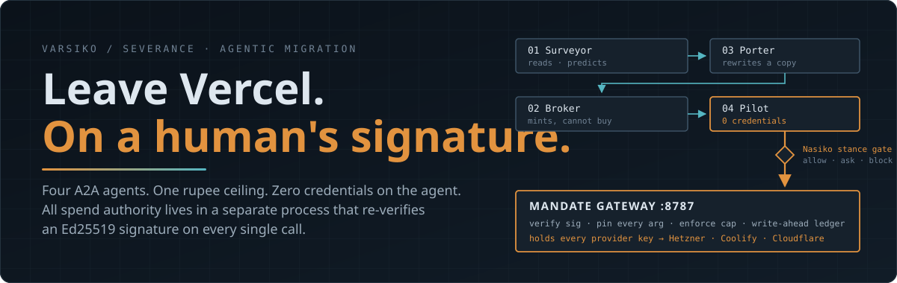
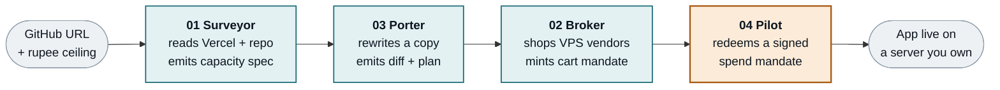
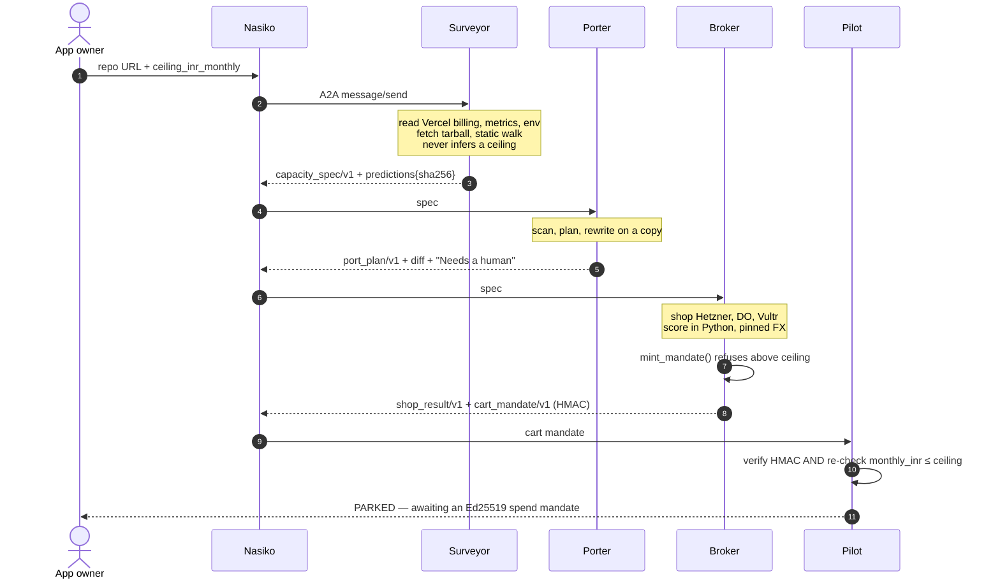
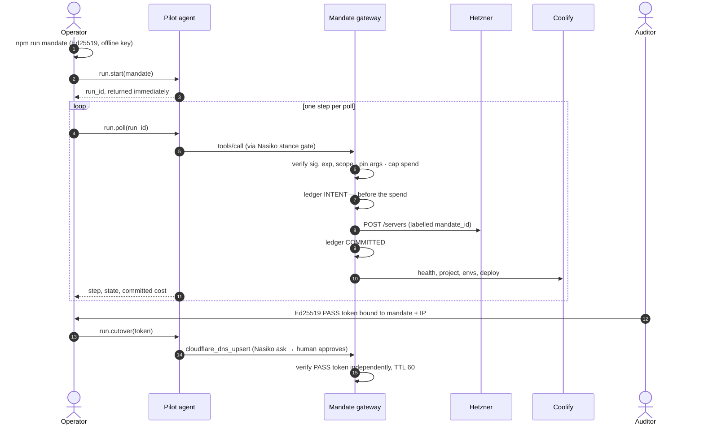
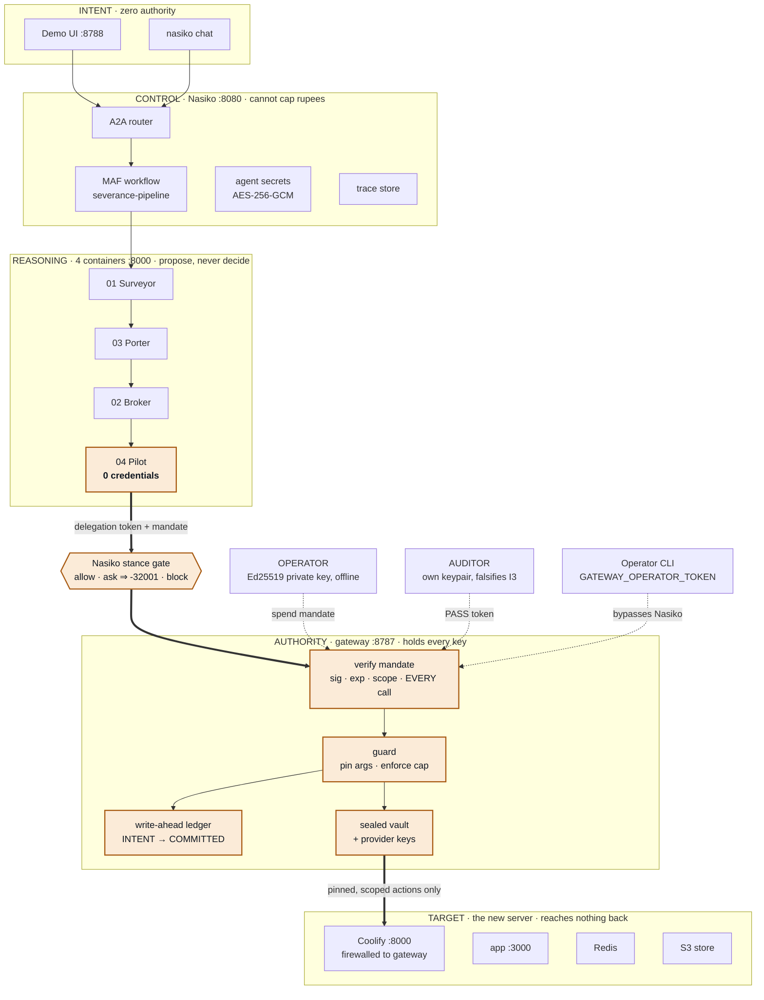
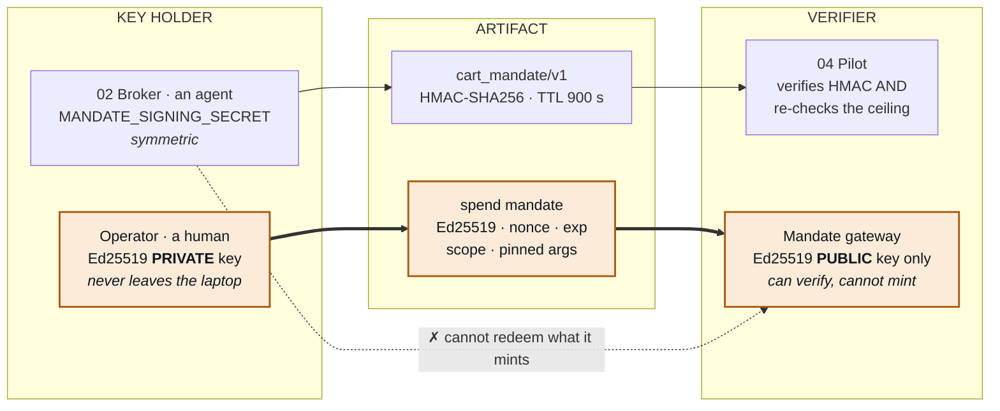
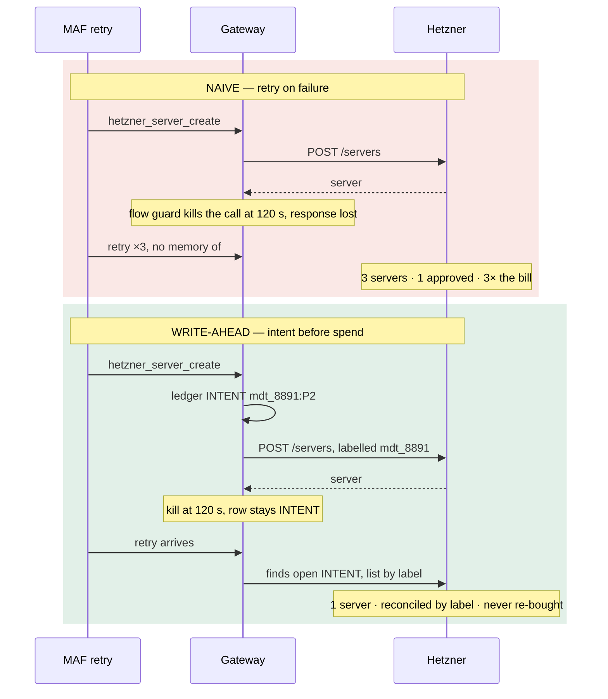
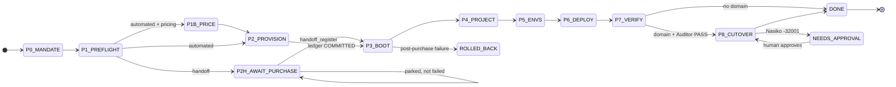
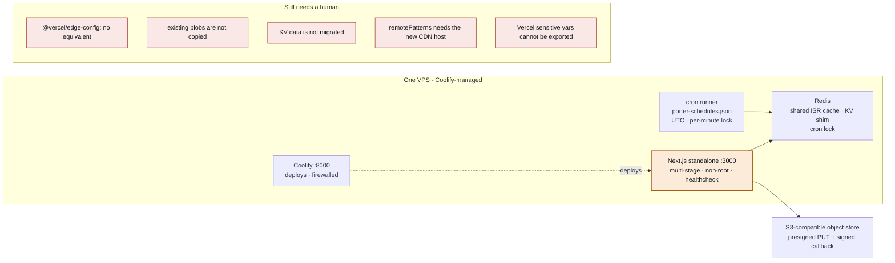
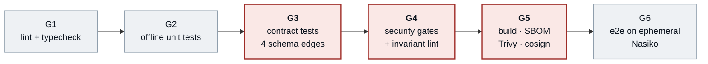

<div align="center">



<br>

**Four A2A agents take a GitHub URL and a rupee ceiling, and move a Vercel-coupled Next.js app onto a server you own.**
**No agent holds a provider credential. Every rupee is authorised by a signature a human made offline.**

<br>


[Quick start](#-quick-start) ·
[How it works](#-how-it-works) ·
[The agents](#-the-four-agents) ·
[Security model](#-the-security-model) ·
[Repo map](#-repository-map) ·
[Full architecture](ARCHITECTURE.md)

</div>

<br>

| `0` | `120 s` | `3×` | `14 / 2` | `9` | `2` |
|:---:|:---:|:---:|:---:|:---:|:---:|
| credentials on the Pilot | flow-guard kill | MAF step retry | agent / operator tools | runbook steps | human gates |

---

## 🧭 Why this exists

Vercel is easy to enter and expensive to leave. Not because of the bill, but because a naive `next start` in Docker **appears to work**. Blob and KV break loudly. Crons, ISR and geolocation go quiet.

| Coupling | Off-platform, if you do nothing | Class |
|---|---|---|
| `@vercel/blob` | No token is issued. Every upload, delete and list fails. | 🔴 Runtime break |
| `@vercel/kv` | The Upstash REST connection does not exist. | 🔴 Runtime break |
| `vercel.json` crons | Routes still answer. Nothing calls them. The digest just stops arriving. | 🟠 **Silent drift** |
| ISR / `revalidate` | Each replica keeps its own `.next/cache`; `revalidatePath` clears one container. | 🟠 **Silent drift** |
| `@vercel/functions` | `geolocation()` returns `undefined` instead of throwing. Geo rules quietly stop applying. | 🟠 **Silent drift** |
| No Dockerfile | Nothing in the repo says how to build or run it anywhere else. | 🟡 Build break |

> [!IMPORTANT]
> **The failure mode that ruins a migration is not the build that breaks. It is the thing that keeps working and quietly stops being correct.**
> Everything below (the falsifiable capacity spec, the honest rewrite report, the signed mandate) exists to make silent drift impossible to ship.

---

## ⚙️ How it works



There is **one** MAF workflow, `severance-pipeline`. In the MAF hop the Porter dry-runs and the Pilot **parks** on a cart mandate; it never completes a purchase inside a 120-second call. The actual spend happens afterwards, one polled step at a time.

### Assessment → parked cart



### The spend run (outside the MAF hop)



---

## 🚀 Quick start

> [!NOTE]
> Everything below runs **offline by default** (`*_OFFLINE=1`). The demo path is *incapable* of spending money, not merely configured not to.

### 1. Try each agent locally, no infrastructure

```sh
# Surveyor / Broker (Python 3.12)
cd agents/severance/surveyor && PYTHONPATH=src python -m pytest
cd agents/severance/broker   && PYTHONPATH=src python -m pytest

# Porter (Node 20): plans the bundled fixture, writes nothing
cd agents/severance/porter   && npm install && npm test && npm run demo

# Pilot (Node 24): runbook + gateway, 19 offline scenarios
cd agents/severance/pilot    && npm install && npm test && npm run pilot
```

### 2. Run the full pipeline on Nasiko

Requires a Nasiko control plane at `http://localhost:8080` with `AGENT_RUNTIME=docker`.

```sh
./agents/severance/deploy-nasiko.sh     # build agents, apply tool rules, upsert severance-pipeline
python3 ui/serve.py                     # demo UI, stdlib only
```

Open **<http://127.0.0.1:8788>**, paste a GitHub URL. The UI calls Nasiko A2A (`/api/orchestrator/a2a`), so traces show up under **Sessions**. It injects a default ceiling of ₹1500; the Surveyor never infers one.

### 3. Drive a signed spend run (operator path)

```sh
cd agents/severance/pilot
cp .env.example .env                    # fill in real values, never commit
npm run keygen                          # Ed25519 mandate + auditor keypairs, vault key
npm run gateway                         # mandate gateway on :8787

npm run mandate -- --server-type cpx31 --location nbg1 \
  --repo owner/name --vercel-project prj_x \
  --domain app.example.com --max-monthly 30 --approved-by you@example.com
```

<details>
<summary><b>Operator commands</b></summary>

| Command | What it does |
|---|---|
| `npm run keygen` | Generates the Ed25519 keypairs and a vault key |
| `npm run gateway` | Starts the MCP mandate gateway (`:8787`) |
| `npm run mandate` | Signs a spend mandate with the offline private key, printing the price it checks |
| `npm run auditor-token` | Issues the Auditor's PASS token bound to mandate + IP |
| `npm run preflight` | Checks config before a live run |
| `npm run live` | Live driver, direct to the gateway (bypasses Nasiko) |
| `npm run handoff` | Handoff lane: a human buys the server at another vendor |
| `npm run vault` | Sealed-vault utilities |

</details>

---

## 🤖 The four agents

| # | Agent | Runtime | Trusted to | Cannot | Emits |
|:-:|---|---|---|---|---|
| 01 | [**Surveyor**](agents/severance/surveyor) | Python 3.12 | read the live Vercel project and repo; commit a hashed, falsifiable prediction | spend, deploy, run the repo, or infer a ceiling | `capacity_spec/v1` |
| 03 | [**Porter**](agents/severance/porter) | Node 20 / TS | rewrite Vercel couplings on a **copy**; say what it could not fix | write to your repo, or drop a finding | `port_plan/v1` + diff |
| 02 | [**Broker**](agents/severance/broker) | Python 3.12 | shop Hetzner / DigitalOcean / Vultr; score in code; mint an HMAC cart mandate | redeem the mandate it mints | `shop_result/v1` + `cart_mandate/v1` |
| 04 | [**Pilot**](agents/severance/pilot) | Node 24 | drive a resumable runbook under a signed mandate | hold **any** provider credential | `pilot_run/v1` |

The Pilot package is deliberately **two processes**: the *agent* an LLM drives, and the *mandate gateway* that holds every key. The boundary is a process boundary with its own authentication, not a module boundary an `import` can cross.

---

## 🔐 The security model

### Eight invariants

Every structural decision derives from one of these. Breaking one is an architecture change, not an implementation change.

| | Invariant | In one line |
|:-:|---|---|
| **I1** | The LLM narrates. Code decides. | A model may write a summary. It may never size a server, pick a verdict or authorise a spend. |
| **I2** | Authority is a signed capability, not a role. | Single-use, scoped, expiring, human-signed, re-verified on every call. |
| **I3** | The predictor never validates. | The Surveyor commits a hashed prediction; a separate Auditor with its own key falsifies it. |
| **I4** | One step per call; resumable and idempotent. | A 120 s flow guard plus 3× retry would otherwise turn one slow purchase into three. |
| **I5** | Untrusted text never becomes authority. | Repo files and vendor pricing pages may inform a display, never widen a bound. |
| **I6** | Secrets flow down, never up. | The agent is the principal with nothing to steal. |
| **I7** | Unfixable is reported, never dropped. | A migration that silently omits a finding is worse than one that refuses. |
| **I8** | Offline by default. | Fixture stores everywhere; CI is network-free. |

### Five planes, split by what each is trusted to do



> [!TIP]
> **The one edge that matters** is the thick line out of the Pilot. It carries a *delegation token* proving **which agent** is calling and a *mandate* proving **what a human authorised**. The gateway requires both, so compromising the agent yields the first and not the second.

### Two mandates, two cryptosystems

Minting is not redeeming, and verifying is not minting. The split of primitives is what makes those sentences true.



Symmetric is correct for the cart mandate: both ends are machines Nasiko provisions. Asymmetric is **required** for the spend mandate. If the gateway could mint, a gateway compromise would be a money-printing compromise.

<details>
<summary><b>The capability, as signed</b></summary>

```jsonc
{
  "mandate_id": "mdt_8891", "nonce": "…", "iat": "…", "exp": "…",
  "approved_by": "operator@…",
  "scope":     ["hetzner:server.create", "coolify:*", "cloudflare:dns.upsert", "…"],  // namespace matcher
  "budget":    { "max_monthly_usd": 60, "max_hourly_usd": 0.12 },                     // enforced in code
  "provision": { "provider": "hetzner", "server_type": "cpx31", "location": "nbg1",
                 "count": 1, "cloud_init_sha256": "<sha256 of the template>" },       // every arg pinned
  "migration": { "vercel_project_id": "…", "git_repository": "…", "domain": "…" },
  "surveyor_prediction_sha256": "…",                                                  // binds I3
  "run_window_minutes": 120
}
```

</details>

### Defence in depth: no single mechanism is sufficient

| Threat | Mechanism A | Mechanism B (independent) |
|---|---|---|
| Over-cap purchase | Broker refuses inside `mint_mandate()` | Pilot re-checks the ceiling on a mandate it did not mint |
| Unauthorised DNS cutover | Nasiko `ask` stance returns `-32001`; a human approves | Gateway verifies an Auditor PASS token bound to this mandate **and this IP** |
| Double purchase | Write-ahead `INTENT` row refuses a re-spend | Gateway reconciles by Hetzner label instead of re-buying |
| Poisoned vendor price | `effective = max(pinned, scraped)`: a page can only *raise* the price | Pinned fallback price table in the guard |
| Agent reaching a provider directly | Every other MCP connector set `enabled: false` | The gateway is the only holder of provider credentials |

### If it is fully compromised

| Compromised | The attacker gets | The attacker still cannot |
|---|---|---|
| Any agent container | read-only Vercel/GitHub tokens, a mandate it was already given | spend outside the pinned arguments, cut DNS over, reach a provider directly |
| Broker | ability to mint cart mandates | exceed the ceiling (the Pilot re-checks) or buy anything |
| Nasiko control plane | agent secrets, delegation tokens, the gateway bearer | forge the operator's Ed25519 signature, so no spend mandate |
| Gateway host | every provider credential (**total loss for spend**) | mint a new mandate, or delete servers outside the mandate's label |
| Operator machine | the signing key (**total loss**) | n/a: this is why the key is offline and mandates are single-use, capped and expiring |

---

## 🧾 Why a write-ahead ledger, and not a retry

Nasiko kills any agent-to-agent call at **120 s**. MAF retries a failed step **3×**. A Hetzner provision that succeeds at 95 s but whose response is lost at 120 s comes back as a *failure*. This is the single most expensive bug the architecture had to design out.



Recording intent **before** the provider call converts an ambiguous outcome from "unknown, so retry" into "unknown, so reconcile". The ledger (append-only JSONL today, a Postgres `UNIQUE(key)` when a second gateway replica exists) is the system of record for money, kept separate from traces and the audit log on purpose.

---

## 🛤️ The runbook advances one step per call

Callers poll. Every step re-verifies the mandate instead of trusting state carried between calls, because Nasiko mints the delegation token per inbound request and it expires in minutes.



| Lane | Who buys | Rollback | Cap enforceable? |
|---|---|---|---|
| **Automated** | the gateway, on Hetzner | `hetzner_server_delete`, confined to servers this mandate labelled | ✅ yes |
| **Handoff** | a human, at any other vendor | **no destroy**: never deletes a server a human paid for | ⚠️ no. Card marked **UNVERIFIED** |

Both lanes converge because `handoff_register` writes the **same `P2` ledger row** an automated purchase writes. Target derivation, the run window, replay protection and every downstream tool then work unchanged, which is why this is one runbook and not two.

<details>
<summary><b>Two bearers on one gateway</b></summary>

| Credential | Held by | Reaches | Cannot |
|---|---|---|---|
| `GATEWAY_BEARER_TOKEN` | Nasiko's MCP connector → the Pilot agent | 14 tools | `handoff_prepare`, `handoff_register` |
| `GATEWAY_OPERATOR_TOKEN` | the human operator's CLI, **outside Nasiko** | `handoff_prepare`, `handoff_register` | buy anything |

The role filter applies to both `tools/list` and `tools/call`: the agent cannot even enumerate the operator's tools. `handoff_register` accepts only a **public IPv4 unicast** address, refusing loopback, RFC 1918, link-local (including `169.254.169.254`), CGNAT, multicast, reserved ranges, IPv6, hostnames and ports, because an unvalidated address from an LLM-driven agent would be a direct SSRF-and-exfiltration primitive.

</details>

---

## 📦 What the customer is left running

The output is itself an architecture, and the Porter's transforms define it.



| Vercel coupling | Replacement | Why this shape |
|---|---|---|
| `@vercel/blob` | S3 shim, identical signatures and return shapes | Call sites do not change. Uploads are replaced **as a pair** (presigned PUT *and* signed callback) |
| `@vercel/kv` | Redis shim reproducing Upstash's auto-JSON serialisation | A plain `ioredis` swap stores `[object Object]` without throwing |
| `vercel.json` crons | extracted schedule + zero-dependency runner | The per-minute Redis lock stops every replica firing the same job |
| ISR / `revalidate` | shared Redis cache handler | Per-replica `.next/cache` means users see different versions of a page |
| `@vercel/functions` geo | explicit replacement | `geolocation()` returns `undefined`, the worst kind of silent drift |
| `@vercel/edge-config` | **none exists**, reported under "Needs a human" | Honesty beats a broken shim (**I7**) |
| no Dockerfile | multi-stage `output: 'standalone'`, non-root, compose | Nothing in the repo said how to build it elsewhere |

---

## 🗺️ Repository map

```text
varsiko-2.0/
├── ARCHITECTURE.md              ← the full document: 19 sections, threat model, ADRs, roadmap
├── agents/severance/
│   ├── deploy-nasiko.sh         ← build agents · apply tool rules · upsert severance-pipeline
│   ├── surveyor/                ← 01 · Python 3.12 · read-only · capacity spec + prediction
│   ├── porter/                  ← 03 · Node 20 / TS · rewrites a copy · templates/ for the shims
│   ├── broker/                  ← 02 · Python 3.12 · adversarial shopping · HMAC cart mandate
│   └── pilot/                   ← 04 · Node 24
│       ├── src/pilot/           │   mandate · ledger · guard · runbook · pricing
│       ├── src/gateway/         │   MCP mandate gateway (separate process, holds keys)
│       ├── src/cli/             │   operator commands: keygen, mandate, live, handoff …
│       ├── src/agent/           │   Nasiko A2A server (run.start / poll / cutover / candidates)
│       ├── tool-rules.json      │   per-agent MCP stances, trailing "*": block
│       └── cloud-init/          │   pinned Coolify bootstrap template
├── ui/                          ← demo UI on :8788, Python stdlib only
└── docs/assets/                 ← README artwork
```

Per-agent READMEs carry the full config tables and secret-setup commands: [Surveyor](agents/severance/surveyor/README.md) · [Broker](agents/severance/broker/README.md) · [Porter](agents/severance/porter/README.md) · [Pilot](agents/severance/pilot/README.md).

### Environment

| Variable | Where | Meaning |
|---|---|---|
| `SURVEYOR_OFFLINE` `BROKER_OFFLINE` `PORTER_OFFLINE` `PILOT_OFFLINE` | every agent | `1` uses fixtures, so the path cannot spend. Set in every `Dockerfile` **and** `deploy-nasiko.sh` |
| `MANDATE_SIGNING_SECRET` | Broker + Pilot, **agent-scoped** | HMAC secret for cart mandates. Never vault-wide |
| `FX_USD_INR` `FX_EUR_INR` `FX_PINNED_AT` | Surveyor, Broker | Pinned, never fetched, so signed artifacts stay verifiable |
| `GATEWAY_BEARER_TOKEN` `GATEWAY_OPERATOR_TOKEN` | gateway | ≥ 32 chars each, must differ, enforced at config load |
| `VAULT_KEY` `MANDATE_PUBLIC_KEY_FILE` `AUDITOR_PUBLIC_KEY_FILE` | gateway | Sealed-vault key and the two verification keys (public only) |
| `HETZNER_TOKEN` `CLOUDFLARE_TOKEN` `VERCEL_TOKEN` `ANAKIN_API_KEY` | gateway | Provider credentials. **No agent holds these** |

> [!WARNING]
> The Ed25519 mandate **private** key lives on the operator's machine (`.local/keys/`, gitignored). It is never in CI, never in Nasiko, never on the gateway. That is not a policy; it is the reason the architecture works.

---

## 🧪 Honest status

An architecture that hides its weak edge is a liability. Every claim in [ARCHITECTURE.md](ARCHITECTURE.md) is tagged `[BUILT]`, `[TARGET]` or `[UNVERIFIED]`.

| ID | Risk | Held in check by | Closed when |
|---|---|---|---|
| **RISK-01** | Coolify's API is plain HTTP on `:8000`, and the gateway sends it a token and every migrated env var | Provisioning refused without a Hetzner firewall; only the token's hash reaches `user_data` | TLS terminates before the first env push |
| **RISK-02** | Nasiko per-agent permission is **default-allow** | Explicit rules plus a trailing `{"pattern":"*","stance":"block"}` | The deploy fails closed on a stance read-back mismatch |
| **RISK-03** | The cloud-init bootstrap follows a community workaround touching Coolify internals | Pinned by SHA-256 inside the signed mandate | Verified on one real box; installer version pinned |
| **RISK-05** | The pinned price table is approximate; Hetzner prices in EUR, the cap is USD | `npm run mandate` prints the value it checks before signing | Re-pinned from the console; currency explicit in `budget` |
| **RISK-08** | The handoff lane cannot enforce a cap or observe checkout | Card marked UNVERIFIED; no-destroy; charset clamps | Accepted by design: documented, not pretended away |

### The pipeline still owed

There is no CI in the repo today, so this is design, not description. CI never holds a spend credential, and the unit of release is the agent, not the repo.



Red gates block merge. **G4 carries an invariant lint** (a pure module that imports `httpx`, `openai` or `fetch` fails the build) because I1 is what makes every number falsifiable, and it decays silently.

### Two SLOs that are not statistical

**Zero orphaned paid servers, and zero spends above a signed mandate's cap.** No error budget. A single violation is an incident, not a draw against a quota.

### Roadmap

- [ ] **Now:** CI gates G1–G4 · contract tests on all four schema edges · deploy hardening (git-SHA versioning, hard-gated tool rules, rollback)
- [ ] **Next:** resolve RISK-01 / RISK-03 on one real box · containerise the gateway · ship audit lines to the trace collector
- [ ] **Later:** Postgres ledger + N gateway replicas · Auditor as a first-class agent · post-cutover Day-2 checklist · DronaHQ operator console

---

## 📚 Further reading

| Document | What is in it |
|---|---|
| [ARCHITECTURE.md](ARCHITECTURE.md) | The whole solution: invariants, planes, contracts, authority, threat model T1–T13, secrets, observability, DevOps, SLOs, ADRs |
| [agent-1-plan.md](agent-1-plan.md) · [agent-2-plan.md](agent-2-plan.md) · [agent-4-plan.md](agent-4-plan.md) | Per-agent design plans |
| [pre-live-test-agent-4-plan.md](pre-live-test-agent-4-plan.md) | Failure drills to run before the first live spend |
| [repo-change-for-buying-server-plan.md](repo-change-for-buying-server-plan.md) | Repo changes for the automated lane and the human handoff lane |

<div align="center">
<sub>Varsiko / Severance · Surveyor · Broker · Porter · Pilot</sub>
</div>
